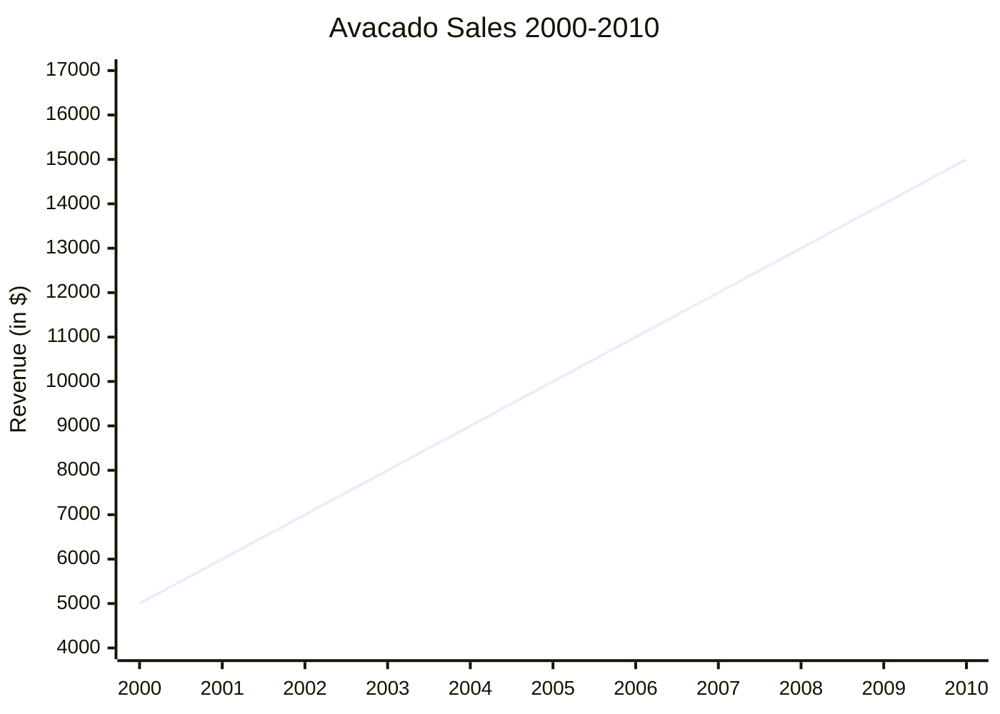
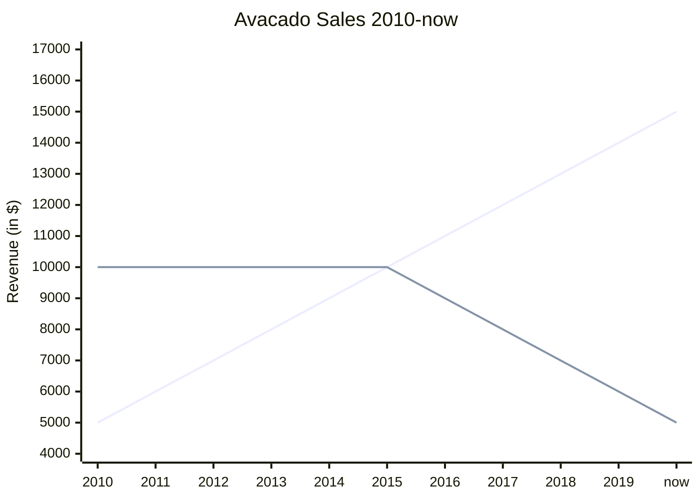

# Business English

## Learn how to introduce yourself in a business setting

### Informal greeting

> Hello! You must be Sue. We've spoken through email before I think. I'm Raj Joshi.

> Yeah! That's right. Nice to meet you, Raj.

> Same here. So, which department are you in, Sue?

> I'm in the Legal department which is on this level. What about you?

> Uh yes, I remember that from your email now. I'm in the marketing department which is on level one.

> Oh, I see. That's good to know. Should we get ready for the meeting now?

> Yeah sure.

!!! question "Hello! You must be _________?"
    If you already know who someone is but you have never actually met them.
    > Hello! You must be Codey

    !!! success "Yeah that's right. Nice to meet you."
    !!! success "Good to meet you."
    !!! success "Lovely to meet you."
    !!! success "Nice to meet you, [Firstname]."
        > Nice to meet you, Andy.
    !!! success "It's good to meet you too, [Firstname]."
        > It's good to meet you too, Bob.
    !!! success "Lovely to meet you, [Firstname]."
        > Lovely to meet you, Sue.
    !!! success "It's nice to meet you, [Firstname]."
        > It's nice to meet you, Josh.

### Formal greeting (with new client)

> "Good morning, Mr. Wilson."

> "Good morning, Mr. Joshi. Pleased to meet you."

> "Me too. Let me introduce myself. I'm Raj Joshi. I'm from ABC Worldwide. I work in the Marketing department and this is my colleague Sue Long from the Legal department."

> "Good morning, Mr. Wilson. Lovely to meet you."

> "What about you, Mr. Wilson?"

> "I'm Andy Wilson. I'm from 123 Enterprises. I'm the managing director of the company"

!!! question "Good [morning|afternoon|evening], [Mr|Mrs|Dr]. [Lastname]"
    * "Good morning" generally after 6am but before 12 noon.
    * "Good afternoon" generally after 12 noon but before 5pm.
    * "Good evening" generally after 5pm.
    !!! danger "Do not say Good night because this is another way to say goodbye."
    !!! success "^'^Pleased to meet you. Welcome to [Company Name]."

!!! quote ""
    !!! quote "Let me introduce myself, I'm _________."
    !!! quote "This is my colleague [Fullname] from the [Department Name] department."
    !!! quote "These are my colleagues [Fullname 1] and [Fullname 2] from the [Department Name] department."

## Learn about the importance of small talk in a business setting

> Good morning

> Good morning

> How are you doing?

> Yeah, good thanks.

> I haven't seen you around before.

> I'm Sue. I just started a new role. In fact, I just moved here.

> And so, where did you move from?

> I'm from Western Australia. Broome actually. Have you been there before? It's a beach town in the Kimberley region. That's in the north west of Australia. Where did you move from?

> Oh, I see, No, I haven't been there before

> What about you? Where do you live?

---
> What do you like to do when you're not working?

> Well, I love to play sports. 

> Ah, right

> Mainly footy but I'm learning to play cricket.

> That's cool.

> I also love to cook and watch TV shows about traveling.

> Ah, I see.

> What about you?

> I just love watching TV shows.

### Asking about hobbies and interests
!!! question "What do you like to do when you're not working?"
!!! question "What do you like to do in your free time?"
!!! question "What do you do outside of work?"
!!! question "What do you do for fun?"

### Fillers
> Ah right

> That's cool

> Wow!

> Yeah

> I see

| Negative  | Neutral |
| --------- | ------- |
| Yeah, nah | Uh huh  |
| Really?   | Ah      |
| Right     | Oh      |
|           | Huh     |
|           | Yeah    |
|           | Right   |

## Learn to explain data and trends in English

> The first graph shows that over a 10-year period, avacado sales increased. 

---

> The next graph shows from 2010 until now. The total sales is a red line while the blue line shows a number of retailers.

> Sales have increased every year for the last three years but the number of retailers has fallen dramatically in the last year.

---
> Hi, Andy, thank you for sending us the data analysis. I was wondering if you could take us through some of the key points

> Yes, certainly. So I did some profit analysis. I **predict** the profit will continue to fall over the next three quarters. But we should not be alarmed by this decline.

> Okay, but why do you say that?

> Well, that's because we **project** sales are going to increase in the coming months.

> And what's driving that?

> Well as we are going into the holidays, spending will raise and therefore, there will be a jump in sales.

> That's good news then looking at these figures I was expecting sales to go down further.

> Not at all. The **forecast** suggests the company will grow strongly over the next few years.

| Going up | Going down |
| -------- | ---------- |
| Rise     | Fall       |
| Jump     | Drop       |
| Grow     | Decline    |
| Climb    | Decrease   |
| Increase | Go down    |
| **Rocket**   | **Plummet**    |

!!! info "to project"
    To guess something based on data or trends.

!!! info "to predict"
    To guess something will happen.

!!! info "to forcast"
    To guess something, usually based on studyingj or analysing previous data.

!!! info "going to"
    To talk about predictions based on evidence.

!!! info "will"
    To talk about predictions based on opinion.

## Learn how to negotiate in a business setting

### Question tag

#### Auxiliary verb or modal verb of the main sentence + subject of the sentence.
- If the sentence is a positive, the question tag must be negative.
!!! example "The process takes around 6 months, **doesn't it**?"
- If the sentence is a negative, the question tag must be positive.
!!! example "You don't have a problem with that, **do you**?"

!!! example "Let's get down to business, **shall we**?"
!!! example "**Don't you**?"
!!! example "**Aren't you**?"
!!! example "So I think that's the final deal, **isn't it**?"
!!! example "**Haven't you**?"
!!! example "**Can't you**?"

#### Answering the question tag
Agree or disagree on the original statement, not the question.

!!! question "We are studying English, aren't we?"
    !!! success "Yes, we are."
!!! question "This is a conversation English course, itn't it?"
    !!! success "No, it's a business English course."
!!! question "Tag questions are useful for negotiations, aren't they?"
    !!! success "Yes, they are."

### Common phrases and words in negotiations

!!! info "Bottom line (noun)"
    The important fact in this situation.
!!! info "Compromise (verb)"
    To change your mind slightly to reach an agreement.
!!! info "Push back (verb)"
    Disagree.
!!! info "Counter proposal (noun)"
    The second offer which is given in reply to the first offer.
!!! info "Point of view (noun)"
    A person's thoughts or ideas.
!!! info "Comply (verb)"
    To agree.
!!! info "Deadlock (noun)"
    A point in the negotiation where no side will change their mind.
!!! info "Mutual (adjective)"
    Agreed by everyone.
!!! info "Trade-off (noun)"
    Something that we give away to get another thing.

## Learn how to prepare for an interview

> Good afternoon. You're Raj right?

> Yes, good afternoon Mr. Wilson. How are you?

> Good thanks. What about you Raj?

> I'm good thank you. I'm realy excited to be speaking with you today. Thank you so much for the opportunity.

> My pleasure. Let's get started. Can you tell me a bit about yourself?

> Yes, sure. I'm from Malaysia. I've been living in Australia for four years now. I came here to study at university. Since I graduated I've been working for the local city council.

### Intonation

#### Rising intonation for yes/no questions.

!!! example "Did you get here ok?"
!!! example "Do you have the necessary documents on you?"
!!! example "Do you know much about the company?"

Rising intonation shows the listener you're feeling positive about what you're saying. Use our voice up at the end of a word
!!! example "Sure"
#### Falling intonation for questions where we're asking for more information.

!!! example "Can you tell me a bit about your experience?"
!!! example "Why did you apply for this role?"
!!! example "What do you bring to this role?"

### Use past simple and present perfect continuous tense in an interview

Present perfect continuous: Have been + verb-ing
    Talk about something that started in the past and is still happening now

!!! example "I have been living"
!!! example "I have been working"

Past simple: 

!!! example "Since I graduated. I have been working"

