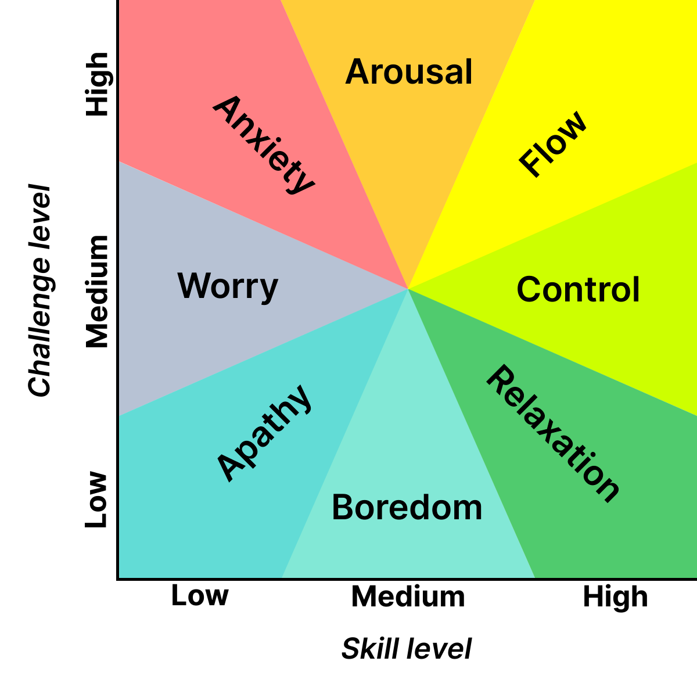

# Flow state: The heart of Developer Experience (DevEx)

“Have you ever been so immersed in something that you forgot about time, hunger or even sleep?” If your answer is yes, that you have entered the flow state.

[![Image]](#)

[Image]: ../../assets/devex.jpg

  - [Thanks to { width="20" } for supporting this content.](https://tekos.net/articles/devops/flow-state-the-heart-of-developer-experience-devex/)

<!-- more -->

## Introduction

In this article, you will learn about:

- What is the flow state actually?
- Why is flow state so important to developers at work?
- How to maintain the flow state at work?
- Why choose flow state as the core goal in the great DevEx?
- Some misconceptions around DevEx?

## What is the flow state?

Named by the psychologist Mihály Csíkszentmihályi in 1970, the flow state in positive psychology, also known as “being in the zone”, or “deep work” is the mental state in which a person performing some activities is fully immersed in a feeling of energized focus, full involvement, and enjoyment in the process of the activity. In essence, flow is characterized by the complete absorption in what one does and a resulting transformation in one’s sense of time.

The flow state can be entered while performing an activity or task which is wholeheartedly engaged for intrinsic purposes. Three conditions must be met to achieve flow:

- The activity must have clear goals and progress.
- The activity must provide clear and immediate feedback.
- Perceived balance is required between the challenge level of the activity and one’s skills level. Confidence in the ability to complete the activity is required.

To achieve the flow state, the activity must be challenging enough to engage us but not so easy that it becomes boring or so complicated that it causes anxiety.

Consider the graph below, based on Csikszentmihalyi’s flow model, for a visualization of where the flow state resides:

<figure markdown="span">
  
  <figcaption>Csikszentmihalyi Flow Model</figcaption>
</figure>

Achieving a flow state is a core element in the creative process. Historical sources suggest that Michelangelo (the Italian artist) may have painted the painting on the ceiling of the Sistine Chapel in the Vatican in a state of Flow, that he painted continuously for many days and was so absorbed in his work that he did not stop, to sleep or eat until the last stroke. Bruce Lee also talked about a psychological state like Flow in his book “The Tao of Jeet Kune Do”. As creative individuals, developers should be able to tap into these same experiences.

However, several problems of the model have been discussed in the literature. One is that it does not ensure the perceived balance between challenges and skills which is said to be the central precondition of the flow state. In 2013, Dr. Schaffer proposed seven flow conditions:

- **Knowing what to do.** Start with knowing your skill set and our limitations.
- **Knowing how to do it**. You need to know how to do something before you can get into the flow state of mind and do it.
- **Knowing how well one is doing**. Knowing how you are doing can help motivate you and increase higher vibration in your life.
- **Knowing where to go (if navigation is involved)**. You need to know where you are going. Have the end in mind, and always be doing something that helps you get there.
- **High perceived challenges**. Challenge yourself. Always be pushing yourself to do better and to be better. Empower yourself to do more and achieve more.
- **High perceived skills**. Perceive the skills you want to learn. We all think we want to accomplish in our lives and the skills we need to do it. Take baby steps and step away from frustration.
- **Freedom from distractions**. Too many pointless meetings throughout the day, chat distractions, noisy offices, too many context switching etc.

## Why do developers need to focus on flow state rather than productivity?

### Flow state increases productivity and creativity

When developers fully immerse themselves in the activity/task/problem, they significantly increase their productivity, creativity, and performance speed. This is better than establishing productivity metrics and may create the wrong incentives. For example, rewarding developers for the number of completed tasks they do will not provide better quality software.

### Flow state makes developers happy at work

Developers tend to be smart, and maintaining a flow state makes their life easier. Matt Kiernander, technical advocate at Stack Overflow, said “When I code, I don’t like disruptions in my flow state. Constantly stopping and starting makes me feel unproductive. We all want to feel like we’re making a difference, and hitting roadblocks at work just because you’re not sure where to find answers is incredibly frustrating.”

At Tekos Interactive, we have windows, quiet surroundings, bright natural light, plants, trees, flowers, and a comfortable chair in the office. All in all, Tekos Interactive values flexibility so we could choose between working in the office or from home. We have clearly defined tasks, timelines, and on-time support from the team. All these things make our developers’ lives happier.

## How to maintain the flow state?

Some of the challenges to staying in a flow state include states of apathy, boredom, and anxiety.

- The state of apathy = low challenges level + low skill level requirements → lack of interest in the activity
- The state of boredom = low challenges level + one’s skill level exceeds those challenges → one to seek higher challenges
- The state of anxiety = challenges are high enough to exceed perceived skill level → distress and uneasiness

These states in general prevent achieving the balance necessary for flow. Csíkszentmihályi has said, “If challenges are too low, one gets back to flow by increasing them. If challenges are too great, one can return to the flow state by learning new skills.”

At Tekos Interactive, we have all kinds of challenge levels (from internal projects to external clients) with a great team behind us so that it is easy to seek advice or support from seniors or managers. All we have to do is deliver the best values to Tekos Interactive’s clients.

## What makes a great DevEx?

“Great DevEx is what you get when developers can easily achieve and maintain flow state at work.“
Choose flow state as the core goal of a great DevEx can also lead to a number of benefits that contribute to making the team more effective, including:

- Improved communication
- Clearer vision and purpose as a result of better leadership
- Less time wasted on menial tasks
- Better hiring and onboarding practices
- Becoming more attractive to potential hires
- Fewer redundant processes
- Better tooling
- Better-quality outcomes (which in turn can translate to happier customers and more money)
- Psychological safety
- Better working environments
- More streamlined engineering practices

Measuring what hurts developers from achieving and maintaining a flow state is the art of measuring what’s NOT productive.

However, too often, companies and their leadership seem to go out of their way to prevent their developers from entering a flow state. Let’s consider again Dr Schaffer’s 7 Flow Conditions:

1. Knowing what to do → Leadership lacks vision and doesn’t provide adequate context, or adequate planning.
2. Knowing how to do it → Engineers have difficulty finding the right tooling, team, or documentation to do their job. Developers are often given tasks out of the scope of their role, such as infrastructure tasks, without meaningful abstractions or good tools, leading to needless cognitive load.
3. Knowing how well one is doing → Insufficient feedback loops and observability to gauge impact and get feedback tend to leave developers in the dark about their performance.
4. Knowing where to go → lack of a developer portal, platform, or hub to help orientate developers within the company. Plus, any existing documentation is often disorganized and it is difficult to find relevant information.
5. High perceived challenges → Developers have to sort through tedious, menial work that’s not challenging or creative. The goals are either too lofty or not engaging enough – or non-existent.
6. High perceived skills → Engineers lacking the ability to foster learning or tackle meaningful challenges that build skills relevant to their career goals. Using tooling that’s not relevant to their job or career or drowned in tedious processes that are pointless.
7. Freedom from distractions → Developer time is taken up by too many pointless meetings peppered throughout the day, Slack distractions, noisy offices, too much context switching etc.

Leadership will do more harm than good by arbitrarily defining what productivity is and forcing it on teams. Leadership instead must aim to implement a culture of measuring everything that hurts the flow state and make it a joint responsibility to improve that – that’s how you improve the quality of outcomes and yes, indirectly, become productive.

At Tekos Interactive, leadership may not be able to make a developer happy in all areas of their life, but it can at least create the best possible condition for flow to occur in their most productive hours, significantly increasing engagement and well-being.

## What DevEx is not?

Now let’s start with some common misconceptions around DevEx.

### DevEx as a Subset of UX

DevEx is not equal to User eXperience (UX), DevEx is a part of UX. UX not only refers to how users interact with a tool, website, or app but also encompasses the entire user journey. Remember, developers are users too – they are internal users of other teams and tools. The UX of the tooling you pick or create will play a crucial part in your DevEx.

### Elevating DevEx: A Focus on Talent

DevEx is not about catering to lazy developers; It’s about hiring the best talent and creating the best conditions for them to work efficiently. DevEx strategy should be based on hiring the best possible people to do the job. Individuals who are eager to learn, self-driven, an adequate cultural fit, and allowing them to get into the flow of work as soon as possible.

### DevEx and AI: A Balanced Approach

DevEx is not implementing AI super tools to save money on staff. As mentioned, tooling is also very important when it comes to your DevEx strategy, but that doesn’t mean it can replace high quality contributors. AI tools are just there to make things easier, they are great assistants, but they are decades away from replacing a human being. They will get things wrong a lot of the time and it requires a human to understand and optimize the outputs and use them into a bigger context.

### DevEx: A Collaborative Approach

DevEx is not just leadership’s responsibility – it’s a joint engineering effort. It doesn’t matter how much the CEO/CTO preaches about the great DevEx if all the work produced by the engineering team is difficult to use and understand. The important thing is that your entire company learns to see other colleagues and teams as their customers/users and deliver work that makes their job easy.

## Reference:

- <https://en.wikipedia.org/wiki/Flow_(psychology)>
- <https://stackoverflow.blog/2022/03/17/new-data-what-makes-developers-happy-at-work/>
- <https://www.opslevel.com/resources/devex-series-part-1-what-is-devex>
